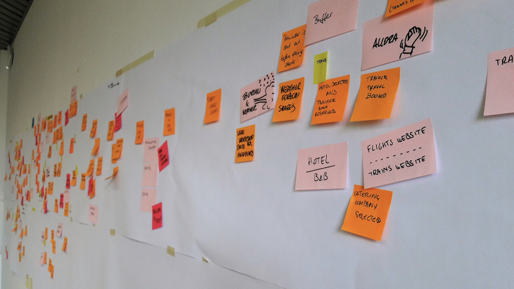
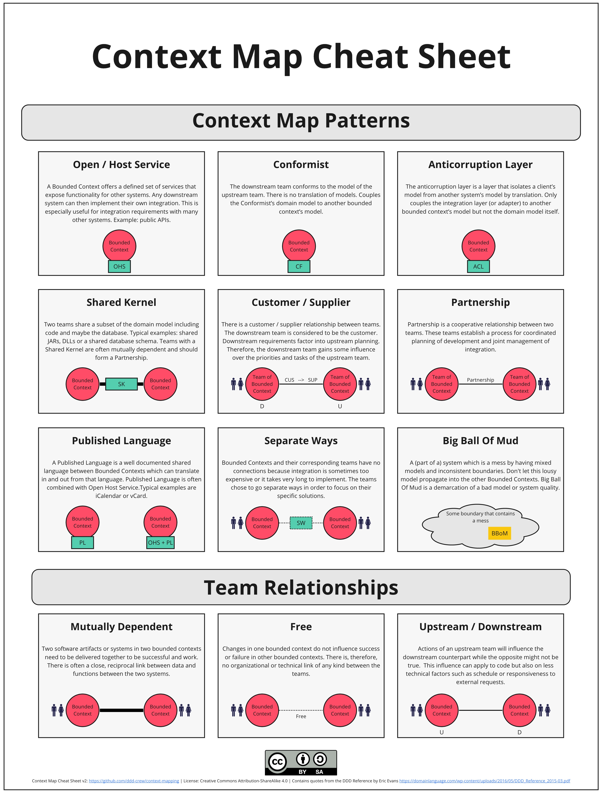

# Domain-Driven Design Kit de démarrage

Ce processus vous fournit un guide étape par étape pour l'apprentissage et l'application pratique de chaque aspect Domain Driven Design (DDD), de l'exploration du modèle d'une organisation au développement d'un modèle domaine.

L'utilisation de ce processus vous guidera à travers chacune des étapes essentielles de la conception d'un système logiciel dans l'esprit du DDD, afin que vous puissiez vous concentrer sur les défis de votre entreprise sans être submergé par l'apprentissage du DDD.

Une fois que vous aurez suivi quelques itérations du processus, vous disposerez de la théorie DDD fondamentale et de l'expérience pratique nécessaires pour approfondir le concept du DDD. Vous serez alors en mesure d'adapter et d'améliorer le processus pour répondre à vos besoins dans n'importe quel contexte. Au cours d'un projet réel, vous serez souvent amené à faire des allers-retours entre ces étapes.

> Ce processus est destiné aux débutants. Il ne s'agit pas d'une séquence linéaire d'étapes que vous devriez standardiser en tant que meilleure pratique. Le DDD est un processus de conception évolutif qui nécessite une itération continue sur tous les aspects de la connaissance et de la conception.

__Navigation:__

* [Quand utiliser le DDD kit de démarrage?](#quand-utilisaer-le-kit-de-dmarrage)
  * [Lancement d'un nouveau projet](#lancement-dun-nouveau-projet)
  * [Début de la migration d'une friche industrielle](#dbut-de-la-migration-dune-friche-industrielle)
  * [Lancement d'un important programme de travail](#lancement-dun-important-programme-de-travail)
  * [Explorez votre domaine pour trouver de nouvelles opportunités d'apprentissage](#explorez-votre-domaine-pour-trouver-de-nouvelles-opportunits-dapprentissage)
  * [Évaluer l'état actuel de votre projet](#valuer-ltat-actuel-de-votre-projet)
  * [Pratiquer ou  apprendre DDD](#pratiquer-ou-apprendre-ddd)
* [Comment adapter le processus?](#comment-adapter-le-processus-)
  * [Commencez par la modélisation collaborative](#commencez-par-la-modlisation-collaborative)
  * [Commencez par évaluer le paysage informatique](#commencez-par-valuer-le-paysage-informatique)
  * [Coder avant de confirmer l'architecture et les limites de l'équipe](#coder-avant-de-confirmer-larchitecture-et-les-limites-de-lquipe)
  * [Répétez les étapes 2 (Découvrir) - 6 (Organiser) avant de passer à l'étape 7 (Définir)](#rptez-les-tapes-2-dcouvrir---6-organiser-avant-de-passer--ltape-7-dfinir)
  * [Organiser les équipes avant de concevoir les contextes](#organiser-les-quipes-avant-de-concevoir-les-contextes)
  * [Définition de l'assemblage et développement](#dfinition-de-lassemblage-et-dveloppement)
* [Le processus](#le-processus)
  * [1. Alignement](#1-alignement)
  * [2. Découvrir](#2-dcourvrir)
  * [3. Découper](#3-dcouper)
  * [4. Connecter](#4-connecter)
  * [5. Stratégie](#5-stratgie)
  * [6. Organiser](#6-organiser)
  * [7. Définir](#7-dfinir)
  * [8. Coder](#8-coder)
* [Contributeur](#contributeurs)
* [Contributions et feedback](#contributions-et-feedback)

## Quand utilisaer le kit de démarrage?

Si vous êtes novice en matière de DDD ou si vous ne savez pas par où commencer, ce processus peut réduire votre charge cognitive. Il vous guidera à travers les scénarios suivants, et peut-être d'autres :

### Lancement d'un nouveau projet

Au début d'un nouveau projet, le nombre de choses auxquelles vous devez penser peut être écrasant. Une ou deux itérations de ce processus peuvent vous aider à mettre les bases en place.

### Début de la migration d'une friche industrielle

Avant de vous atteler à la modernisation de votre système existant, quelques itérations de ce processus peuvent vous aider à découvrir les informations essentielles nécessaires pour créer une vision de votre architecture cible.

### Lancement d'un important programme de travail

Lorsque le lancement d'un nouveau projets impliquant un investissement important de la part de nombreuses équipes, il est essentiel de couvrir les 8 étapes du processus. Ce processus peut vous guider lors des premières itérations.

### Explorez votre domaine pour trouver de nouvelles opportunités d'apprentissage

Le développement de logiciels est un processus d'apprentissage. Vous pouvez appliquer le kit de démarrage DDD à tout moment pour découvrir de nouvelles perspectives, identifier de nouvelles opportunités, ou simplement partager des connaissances au sein de l'équipe.

### Évaluer l'état actuel de votre projet

Ce processus peut servir de base pour évaluer dans quelle mesure votre système actuel est aligné sur le domaine et le modèle d'entreprise.

### Réorganisation des équipes

Une architecture à couplage faible permet aux équipes de travailler en parallèle sans être bloquées. Une architecture à couplage faible doit également être alignée sur le couplage du domaine. Ce processus vous aidera à concevoir une architecture logicielle et une structure d'équipe en phase avec votre domaine.

### Pratiquer ou apprendre DDD

Ce processus est idéal lorsque vous êtes novice en DDD et que vous souhaitez vous exercer, ou lorsque vous souhaitez enseigner aux autres les différents aspects de la modélisation d'un domaine. Il est important de préciser que ce processus linéaire n'est pas un processus réaliste. Il s'agit simplement d'un point de départ pour réduire la charge cognitive jusqu'à ce que vous ayez confiance en DDD.

## Comment adapter le processus ?

Ce processus peut être personnalisé de nombreuses façons. Dans le cadre d'un projet réel, vous passerez d'une étape à l'autre en fonction des nouvelles connaissances acquises ou nécessaires.

Vous trouverez ci-dessous quelques raisons de décider quand changer l'ordre ou passer d'une étape à l'autre.

### Commencez par la modélisation collaborative

Si vous souhaitez que toute votre équipe collabore immédiatement, il peut être plus facile de modéliser le domaine qui leur est familier que de parler de modèles d'entreprise et de stratégie avec lesquels ils sont moins à l'aise.

### Commencez par évaluer le paysage informatique

Avant de se pencher sur la vision de l'entreprise et d'approfondir le domaine, il serait peut-être préférable de commencer par visualiser l'architecture existante. Commencez par l'étape 5 et dressez la carte de votre portefeuille stratégique pour voir quelles sont les principales contraintes auxquelles vous serez confronté.

### Coder avant de confirmer l'architecture et les limites de l'équipe

Sur certains projets, il est judicieux de commencer par écrire du code plus tôt. Vous devez peut-être livrer un MVP ou le domaine est si complexe que la création d'un modèle en code est nécessaire avant de pouvoir envisager l'architecture.

### Répétez les étapes 2 (Découvrir) - 6 (Organiser) avant de passer à l'étape 7 (Définir)

Avant de vous plonger dans la définition des bounded contexts, il peut être bénéfique de modéliser le domaine plusieurs fois et de rechercher différentes façons de décomposer votre système en sous-domaines et équipes.

### Organiser les équipes avant de concevoir les contextes

Pour un grand nombre de projets, il existe des contraintes organisationnelles dont nous devons tenir compte. Si tel est le cas, vous devriez envisager d'identifier les structures d'équipe possibles avant de concevoir des architectures que vous ne serez jamais en mesure de mettre en œuvre.

### Définition de l'assemblage et développement

Les étapes 7 (Définir) et 8 (Coder) peuvent se dérouler simultanément. Cela peut se produire lorsque vous codez un contexte délimité et que les connaissances acquises lors de l'écriture du code vous amènent à modifier la conception de haut niveau

## Le processus

Le processus de modélisation est composé de 8 étapes qui sont présentées ci-dessous.

Un bon talk qui donne un aperçu du processus dans le contexte des phases classqiues de la conception d'architectures socio-techniques est le suivant ["Sociotechnical Architecture: co-designing technical & organizational architecture to maximize impact"](https://www.youtube.com/watch?v=ekMPm78KFj0&feature=youtu.be&t=1820) by [Eduardo da Silva](@emgsilva).
Eduardo regroupe les activités du processus et ses 8 étapes en [4 phases distinces](https://speakerdeck.com/emgsilva/intro-to-sociotechnical-architecture-co-designing-technical-and-organizational-architecture-to-maximize-impact?slide=31), nomées: 
1. Aligner et comprendre
2. Architecture stratégique
3. Stratégie et conception de l'organisation
4. Architecture tactique.

### 1. Alignement

Aligner nos priorités sur le modèle économique de l'organisation, les besoins de ses utilisateurs et ses objectifs à court, moyen et long terme.

Chaque décision que nous prenons concernant l'architecture, le code ou l'organisation a des conséquences pour l'entreprise et les utilisateurs. Pour concevoir, construire et faire évoluer les systèmes logiciels le plus efficacement possible, nos décisions doivent avoir un impact optimal sur l'entreprise, ce qui n'est possible que si nous sommes alignés sur les objectifs de l'entreprise et si nous répondons aux besoins actuels et futurs des utilisateurs.

Une architecture et/ou des contextes mal conçues peuvent avoir un impact négatif ou même rendre impossible la réalisation de ces objectifs.

Comme point de départ, nous recommandons [The Business Model Canvas](https://www.strategyzer.com/canvas/business-model-canvas) pour la partie business, [User Story Mapping](https://www.jpattonassociates.com/user-story-mapping/) pour la perspective utilisateur.

#### Outils

- [Impact Mapping](https://www.impactmapping.org/)
- [The Business Model Canvas](https://www.strategyzer.com/canvas/business-model-canvas)
- [The Product Strategy Canvas](https://melissaperri.com/blog/2016/07/14/what-is-good-product-strategy)
- [Wardley Mapping](https://learnwardleymapping.com/)
- [User Story Mapping](https://www.jpattonassociates.com/user-story-mapping/)

#### Qui impliquer

- Les personnes qui conçoivent, construisent et testent les logiciels
- Les personnes qui ont une connaissance du domaine
- Des personnes qui comprennent le produit et la stratégie commerciale
- Les vrais utilisateurs finaux, pas seulement leurs représentants dans votre organisation

### 2. Décourvrir

Découvrir le domaine de manière visuelle et collaborative.

C'est l'aspect le plus crucial du DDD. Vous ne pouvez pas faire l'impasse sur la découverte. Si l'ensemble de votre équipe n'a pas une bonne compréhension du domaine, toutes les décisions relatives au logiciel seront erronées.

La diffusion de la connaissance du domaine au sein de toute l'équipe créera une compréhension commune. Cela permet aux développeurs de construire un système logiciel aligné sur le domaine, qui peut être plus flexible pour intégrer les changements futurs de l'entreprise.

En veillant à ce que la connaissance du domaine soit diffusée dans toute l'équipe, les membres de celle-ci peuvent apporter des idées pour améliorer le produit.

> #### La découverte est permanente
>
> Les équipes qui réussissent avec le DDD pratiquent fréquemment les techniques de découverte. Il y a toujours à apprendre sur le domaine.
>
> Lors de la première tentative de découverte, un facilitateur expérimenté dans des techniques comme l'EventStorming peut aider l'équipe à voir les véritables avantages de la découverte au-delà d'un niveau superficiel.
>
> Nous vous encourageons vivement à consulter [Visual Collaboration Tools] (https://leanpub.com/visualcollaborationtools).

Comme point de départ, nous recommandons [EventStorming] (https://www.eventstorming.com/).

#### Outils

- [Domain Storytelling](https://domainstorytelling.org/)
- [Example Mapping](https://cucumber.io/blog/bdd/example-mapping-introduction/)
- [EventStorming](https://www.eventstorming.com/)
- [User Journey Mapping](https://boagworld.com/audio/customer-journey-mapping/)
- [User Story Mapping](https://www.jpattonassociates.com/user-story-mapping/)

#### Qui impliquer

- Les personnes qui conçoivent, construisent et testent les logiciels
- Personnes ayant une connaissance du domaine
- Les personnes qui comprennent la stratégie du produit et de l'entreprise
- Personnes qui comprennent les besoins et les problèmes des clients
- Utilisateurs finaux réels

### 3. Découper

Décomposer le domaine en sous-domaines - des parties du domaine faiblement couplées.

Nous décomposons un grand domaine de problèmes en sous-domaines pour quelques raisons essentielles :

- réduire la charge cognitive, afin que nous puissions raisonner sur des parties du domaine de manière indépendante,
- donner de l'autonomie aux équipes de développement, afin qu'elles puissent travailler sur des parties distinctes de la solution,
- identifier un couplage lâche et une cohésion élevée dans le domaine, ce qui se répercute sur notre architecture logicielle et notre structure d'équipe.

Pour commencer, nous vous recommandons de découper votre événement en sous-domaines et en [Context Maps](https://speakerdeck.com/mploed/visualizing-sociotechnical-architectures-with-context-maps).

*Credit: Alberto Brandolini*

#### Outils

- [Business Capability Modelling](https://www.slideshare.net/trondhr/from-capabilities-to-services-modelling-for-businessit-alignment-v2)
- [Design Heuristics](https://www.dddheuristics.com/)
- [EventStorming with sub-domains](https://www.eventstorming.com/)
- [Independent Service Heuristics](https://github.com/TeamTopologies/Independent-Service-Heuristics)
- [Visualising Sociotechnical Architecture with Context Maps](https://speakerdeck.com/mploed/visualizing-sociotechnical-architectures-with-context-maps)

#### Qui impliquer

- Les personnes qui conçoivent, construisent et testent les logiciels
- Personnes ayant une connaissance du domaine

### 4. Connecter

Connecter les sous-domaines dans une architecture à couplage faible qui répond aux cas d'utilisation de bout en bout.

Il est impératif non seulement de décomposer un grand domaine en plusieurs parties, mais aussi de concevoir avec soin les interactions entre ces parties afin de minimiser le couplage et la complexité indésirables. Il est nécessaire de remettre en question la conception initiale en appliquant des cas d'utilisation concrets pour découvrir la complexité cachée.

Comme point de départ, nous recommandons [Domain Message Flow Modelling](https://github.com/ddd-crew/domain-message-flow-modelling).

#### Outils

- [Business Process Model and Notation](https://en.wikipedia.org/wiki/Business_Process_Model_and_Notation)
- [Domain Message Flow Modelling](https://github.com/ddd-crew/domain-message-flow-modelling)
- [Process Modelling EventStorming](https://www.eventstorming.com/)
- [Sequence Diagrams](https://en.wikipedia.org/wiki/Sequence_diagram)

#### Qui impliquer

- Les personnes qui conçoivent, construisent et testent les logiciels
- Personnes ayant une connaissance du domaine

### 5. Stratégie

Dressez une carte stratégique de vos sous-domaines afin d'identifier les domaines principaux : les parties du domaine qui ont le plus grand potentiel de différenciation commerciale ou d'importance stratégique.

Le temps et les ressources étant limités, il est essentiel de comprendre sur quelles parties du domaine il faut se concentrer pour obtenir un impact commercial optimal.

En analysant vos domaines de base, vous aurez une meilleure idée de la qualité et de la rigueur à apporter à chaque partie de votre système, et vous serez en mesure de prendre des décisions très éclairées en matière de construction, d'achat ou d'externalisation.

Comme point de départ, nous vous recommandons [Core Domain Charts](https://github.com/ddd-crew/core-domain-charts).

#### Outils/Ressources

- [Core Domain Charts](https://github.com/ddd-crew/core-domain-charts)
- [Purpose Alignment Model](https://www.informit.com/articles/article.aspx?p=1384195&seqNum=2)
- [Wardley Mapping](https://learnwardleymapping.com/)
- [Revisiting the Basics of Domain-Driven Design](https://vladikk.com/2018/01/26/revisiting-the-basics-of-ddd/)

#### Qui impliquer

- Des personnes qui comprennent la stratégie de produit et d'entreprise
- Les personnes qui conçoivent, construisent et testent les logiciels
- Personnes ayant une connaissance du domaine

### 6. Organiser

Organisez des équipes autonomes, optimisées pour un flux rapide et alignées sur les limites du contexte.

Les équipes doivent être organisées de manière à être autonomes, à avoir des objectifs clairs et à se sentir concernées. Pour ce faire, nous devons prendre en compte les contraintes organisationnelles, afin que les équipes s'organisent pour un workflow rapide.

> #### Equipe auto-organisée
>
> L'organisation n'est pas quelque chose que l'on impose aux équipes, celles-ci doivent plutôt être impliquées dans le processus de définition de leurs limites, interactions et responsabilités.
>
> Certaines entreprises, comme Red Gate Software, font confiance à leurs équipes et leur donnent les moyens de [s'organiser pleinement].(https://medium.com/ingeniouslysimple/how-redgate-ran-its-first-team-self-selection-process-4bfac721ae2).

Nous pouvons optimiser la façon dont les gens collaborent les uns avec les autres si nous alignons les équipes sur les contextes. Pour dimensionner correctement les équipes, nous devons tenir compte des talents disponibles, de la charge cognitive, des frais de communication et du facteur bus.

Comme point de départ, nous recommandons de visualiser l'architecture sociotechnique à l'aide de l'outil [Context Maps](https://speakerdeck.com/mploed/visualizing-sociotechnical-architectures-with-context-maps). A brief overview of the most important patterns can be found under the [context-mapping](https://github.com/ddd-crew/context-mapping) GitHub Project.

*Credit: Michael Plöd*

#### Outils

- [Dynamic Reteaming](https://leanpub.com/dynamicreteaming) 
- [Pioneers, Settlers & Town Planners](http://wardleypedia.org/mediawiki/index.php/Pioneers_settlers_town_planners)
- [Team Topologies](https://teamtopologies.com/)
- [Visualising Sociotechnical Architecture with Context Maps](https://speakerdeck.com/mploed/visualizing-sociotechnical-architectures-with-context-maps)

#### Qui impliquer

- Les personnes qui conçoivent, construisent et testent les logiciels
- Personnes ayant une connaissance du domaine
- Personnes qui comprennent le produit et la stratégie commerciale

### 7. Définir

Définir les rôles et les responsabilités de chacun [bounded context](https://martinfowler.com/bliki/BoundedContext.html).

Avant de vous engager dans une conception, prenez des décisions explicites sur les choix qui peuvent avoir un impact important sur la conception globale. Ayez ces conversations tôt, alors qu'il est encore facile de changer d'avis et d'explorer d'autres modèles.

Concevez de manière collaborative et visuelle et commencez à prendre en compte les limites techniques afin de découvrir les contraintes ou les opportunités.

Comme point de départ, nous recommandons le [Bounded Context Canvas](https://github.com/ddd-crew/bounded-context-canvas).

#### Outils

- [Bounded Context Canvas](https://github.com/ddd-crew/bounded-context-canvas)
- [C4 System Context Diagram](https://c4model.com/#SystemContextDiagram)
- [Quality Storming](https://speakerdeck.com/mploed/quality-storming)

#### Qui impliquer

- Les personnes qui conçoivent, construisent et testent les logiciels
- Personnes ayant une connaissance du domaine
- Personnes responsables du produit

### 8. Coder

Codez le modèle du domaine.

En alignant le code sur le domaine, il est plus facile de modifier le code lorsque le domaine change. En modélisant l'espace du problème en collaboration avec des experts, les développeurs ont la possibilité d'apprendre à connaître le domaine et de minimiser les malentendus.

Comme point de départ, nous recommandons le [Aggregate Design Canvas](https://github.com/ddd-crew/aggregate-design-canvas).

#### Outils

- [Aggregate Design Canvas](https://github.com/ddd-crew/aggregate-design-canvas)
- [C4 Component Diagrams](https://c4model.com/#ComponentDiagram)
- [Design-Level EventStorming](https://www.eventstorming.com/)
- [Event Modeling](https://eventmodeling.org/posts/what-is-event-modeling/)
- [Hexagonal Architecture](https://en.wikipedia.org/wiki/Hexagonal_architecture_(software))
- [Mob Programming](https://mobprogramming.org/)
- [Model Exploration Whirlpool](https://domainlanguage.com/ddd/whirlpool/)
- [Onion Architecture](https://jeffreypalermo.com/2008/07/the-onion-architecture-part-1/)
- [Unified Modelling Language](https://en.wikipedia.org/wiki/Unified_Modeling_Language)

#### Qui impliquer

- Les personnes qui conçoivent, construisent et testent les logiciels

## Traduction

Ce repository n'est qu'un travail de traduction du repository suivant [ddd-starter-modelling-process](https://github.com/ddd-crew/ddd-starter-modelling-process)

## Contributeurs

Merci à tous les [contributeurs actuels et futurs](https://github.com/ddd-crew/ddd-starter-modelling-process/graphs/contributors) et aux personnes suivantes qui ont toutes contribué au kit de démarrage de DDD :

- [Ciaran McNulty](https://github.com/ciaranmcnulty)
- [Eduardo da Silva](https://github.com/emgsilva)
- [Gien Verschatse](https://twitter.com/selketjah)
- [James Morcom](https://twitter.com/morcs)
- [Maxime Sanglan-Charlier](https://twitter.com/__MaxS__)

[![CC BY 4.0][cc-by-shield]][cc-by]

Cette œuvre est soumise à une licence [Creative Commons Attribution 4.0 International
License][cc-by].

[![CC BY 4.0][cc-by-image]][cc-by]

[cc-by]: http://creativecommons.org/licenses/by/4.0/
[cc-by-image]: https://i.creativecommons.org/l/by/4.0/88x31.png
[cc-by-shield]: https://img.shields.io/badge/License-CC%20BY%204.0-lightgrey.svg
